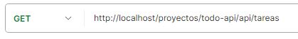
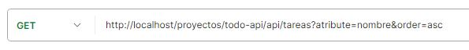
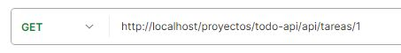

# https://markdown.es/sintaxis-markdown/
## Índice
1. [TaskApiController](#documentación-taskapicontroller)
    - [Función `getTasks()`](#función-gettasks)
    - [Función `getTask()`](#función-gettask)
2. [Aclaraciones Importantes!!!](#aclaraciones)
  
3. [Requisitos y notas adicionales](#requisitos-y-notas-adicionales)

___

# Documentación `TaskApiController`

## Función `getTasks()`

La función `getTasks` del controlador obtiene todas las tareas de la base de datos y envía una respuesta adecuada al cliente basado en el resultado.

## Ejemplos de uso
### Ejemplo 1: Obtención exitosa de tareas.
### Method: `GET`.
### URL: `todo-api/api/tareas`.

A continuacíon se detalla imágen de la URL:



Si hay tareas en la base de datos, la función enviará una respuesta con código 200 y las tareas en formato JSON:
```json
{
    "status": 200,
    "data": [
        {
            "id": 1,
            "nombre": "Tarea 1",
            "descripcion": "Descripción de la tarea 1"
        },
        ...
    ]
}
```
## Ejemplos de uso Query Params
 A continuación se detallan los posibles parámetros que puede recibir la URL:
- **atribute**; permite filtrar por los siguiente atributos, los valores que puede tomar son los siguientes:
    - id
    - nombre
    - descripcion
    - prioridad
    - finalizada
    
- **order** Permite ordenar dichos atributos, los valores que puede tomar son los siguientes:
    - ASC
    - DESC

### Ejemplo de URL con parámetros: `?atribute=nombre&order=asc`.

A continuacíon se detalla imágen de la URL:



### Ejemplo 2: Tareas no encontradas

Si no existen tareas en la base de datos, la función enviará una respuesta con código 404 y un mensaje de error:
```json
{
   {
    "status": 404,
    "message": "No hay tareas en la base de datos"
   }
}
```

### Ejemplo 3: Error de servidor

Si ocurre un error del servidor, la función enviará una respuesta con código 500 y un mensaje de error:

```json
{
    "status": 500,
    "message": "Error de servidor: [detalles del error]"
}
```
___

## Función `getTask()`

La función `getTask` del controlador obtiene una tarea específica de la base de datos y envía una respuesta adecuada al cliente basado en el resultado.

### Parámetros
**`$params (array)`: Un array asociativo que contiene los parámetros de la solicitud. En este caso, se espera que contenga '`:ID`', el identificador de la tarea que se desea obtener.**


## Ejemplos de uso
### Ejemplo 1: Obtención exitosa de una tarea.
### Method: `GET`.
### Params: `{id}`.
### URL: `todo-api/api/tareas/1`.

A continuacíon se detalla imágen de la URL:



Si la tarea con el ID proporcionado existe, la función enviará una respuesta con código 200 y la tarea en formato JSON:
```json
{
    "status": 200,
    "data": [
        {
            "id": 1,
            "nombre": "Tarea 1",
            "descripcion": "Descripción de la tarea 1"
        }
    ]
}
```

### Ejemplo 2: Tarea no encontradas

Si no existe una tarea con el ID proporcionado, la función enviará una respuesta con código 404 y un mensaje de error:
```json
{
   {
    "status": 404,
    "message": "No existe la tarea con id: 1"
   }
}
```

### Ejemplo 3: Error de servidor

Si ocurre un error del servidor, la función enviará una respuesta con código 500 y un mensaje de error:

```json
{
    "status": 500,
    "message": "Error de servidor: [detalles del error]"
}
```
___

# Aclaraciones

En caso de utilizar el token, deben detallar paso a paso su forma de uso, como tambien deben detallar cuales son las funciones que tiene que recibir dicho token y la forma de como recibirlo.

___

## Requisitos y notas adicionales
- Modelo de tarea debe implementar los siguientes métodos `getTasks`, `getTask`.
- Modelo de usuario debe implementar los siguientes métodos `getAllUsers`, `getUser`.
- Vista que implemente el método `response`.
