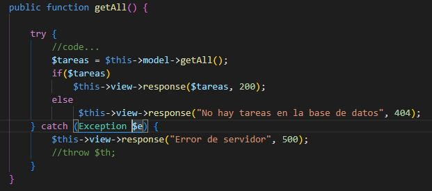

# Documentación de funciones del controlador `TaskApiController`

## Índice
1. [Función `getAll()`](#función-getall)
2. [Función `getTask()`](#función-gettask)
3. [Requisitos y notas adicionales](#requisitos-y-notas-adicionales)

## Función `getAll()`

## Descripción
La función `getAll` del controlador obtiene todas las tareas de la base de datos y envía una respuesta adecuada al cliente basado en el resultado.

### CÓDIGO ESCRITO A MANO (COPY - PASTE DEL CONTROLADOR)

```php
public function getAll() {
    try {
        // Obtener todas las tareas del modelo
        $tareas = $this->model->getAll();
        
        if ($tareas) {
            // Si hay tareas, devolverlas con un código 200 (éxito)
            $response = [
                "status" => 200,
                "data" => $tareas
            ];
            $this->view->response($response, 200);
        } else {
            // Si no hay tareas, devolver un mensaje con un código 404 (no encontrado)
            $response = [
                "status" => 404,
                "message" => "No hay tareas en la base de datos"
            ];
            $this->view->response($response, 404);
        }
    } catch (Exception $e) {
        // En caso de error del servidor, devolver un mensaje con un código 500 (error del servidor)
        $response = [
            "status" => 500,
            "message" => "Error de servidor: " . $e->getMessage()
        ];
        $this->view->response($response, 500);
    }
}
```

### CÓDIGO GUARDADO COMO IMAGEN
#### REALIZAR CAPTURA -> GUARDARLA EN CARPETA CORRESPONDIETE


### Retorno
La función no retorna ningún valor directamente. En su lugar, envía una respuesta al cliente utilizando el objeto `view`. Los posibles códigos de estado de respuesta son:

- **200 OK:** Si se obtuvieron tareas correctamente.
- **404 Not Found:** Si no hay tareas en la base de datos.
- **500 Internal Server Error:** Si ocurre un error del servidor al intentar obtener las tareas.

## Ejemplos de uso `http://localhost/proyectos/todo-api/api/tareas`
### Ejemplo 1: Obtención exitosa de tareas

Si hay tareas en la base de datos, la función enviará una respuesta con código 200 y las tareas en formato JSON:
```json
{
    "status": 200,
    "data": [
        {
            "id": 1,
            "nombre": "Tarea 1",
            "descripcion": "Descripción de la tarea 1"
        },
        ...
    ]
}
```

### Ejemplo 2: Tareas no encontradas

Si no existen tareas en la base de datos, la función enviará una respuesta con código 404 y un mensaje de error:
```json
{
   {
    "status": 404,
    "message": "No hay tareas en la base de datos"
   }
}
```

### Ejemplo 3: Error de servidor

Si ocurre un error del servidor, la función enviará una respuesta con código 500 y un mensaje de error:

```json
{
    "status": 500,
    "message": "Error de servidor: [detalles del error]"
}
```

### Notas 

- **La inclusión del mensaje de excepción (`$e->getMessage()`) en la respuesta de error del servidor puede ser útil para depuración, pero puede exponer detalles sensibles del servidor. Considera esta práctica con cuidado, especialmente en entornos de producción.** 
- **Asegúrate de manejar adecuadamente las excepciones y errores en el modelo y la vista para evitar problemas inesperados.** 


___


## Función `getTask()`

## Descripción
La función `getTask` del controlador obtiene una tarea específica de la base de datos y envía una respuesta adecuada al cliente basado en el resultado.

### CÓDIGO ESCRITO A MANO (COPY - PASTE DEL CONTROLADOR)

```php
public function getTask($params = null) {
        $id = $params[':ID'];

        try {
            // Obtiene una tarea del modelo
            $tarea = $this->model->get($id);
            // Si existe la tarea, la retorna con un código 200 (éxito)
            if($tarea){
                $response = [
                "status" => 200,
                "data" => $tarea
               ];
                $this->view->response($response, 200);
            //    $this->view->response($tareas, 200);

            }
            else
                // Si exite la tarea, retorna un mensaje con un código 404 (no encontrado)
                 $this->view->response("No existe la tarea con id: $id", 404);
        } catch (Exception $e) {
            // En caso de error del servidor, devolver un mensaje con un código 500 (error del servidor)
            $this->view->response("Error de servidor", 500);
        }

    }  
```
### Parámetros
**`$params (array)`: Un array asociativo que contiene los parámetros de la solicitud. En este caso, se espera que contenga '`:ID`', el identificador de la tarea que se desea obtener.**

### Retorno
La función no retorna ningún valor directamente. En su lugar, envía una respuesta al cliente utilizando el objeto `view`. Los posibles códigos de estado de respuesta son:

- **200 OK:** Si se obtuvieron tareas correctamente.
- **404 Not Found:** Si no hay tareas en la base de datos.
- **500 Internal Server Error:** Si ocurre un error del servidor al intentar obtener las tareas.

## Ejemplos de uso `http://localhost/proyectos/todo-api/api/tareas/1`
### Ejemplo 1: Obtención exitosa de la tarea

Si la tarea con el ID proporcionado existe, la función enviará una respuesta con código 200 y la tarea en formato JSON:
```json
{
    "status": 200,
    "data": [
        {
            "id": 1,
            "nombre": "Tarea 1",
            "descripcion": "Descripción de la tarea 1"
        },
        ...
    ]
}
```

### Ejemplo 2: Tarea no encontradas

Si no existe una tarea con el ID proporcionado, la función enviará una respuesta con código 404 y un mensaje de error:
```json
{
   {
    "status": 404,
    "message": "No hay tareas en la base de datos"
   }
}
```

### Ejemplo 3: Error de servidor

Si ocurre un error del servidor, la función enviará una respuesta con código 500 y un mensaje de error:

```json
{
    "status": 500,
    "message": "Error de servidor: [detalles del error]"
}
```

### Notas 

- **La inclusión del mensaje de excepción (`$e->getMessage()`) en la respuesta de error del servidor puede ser útil   para depuración, pero puede exponer detalles sensibles del servidor. Considera esta práctica con cuidado, especialmente en entornos de producción.** 
- **Asegúrate de manejar adecuadamente las excepciones y errores en el modelo y la vista para evitar problemas inesperados.** 


___


## Requisitos y notas adicionales
- Modelo que implemente los métodos `getAll`, `getTask`.
- Vista que implemente el método `response`.